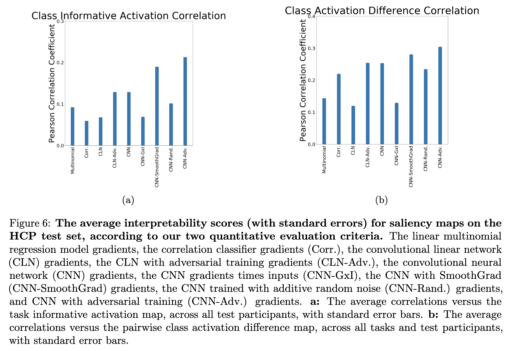
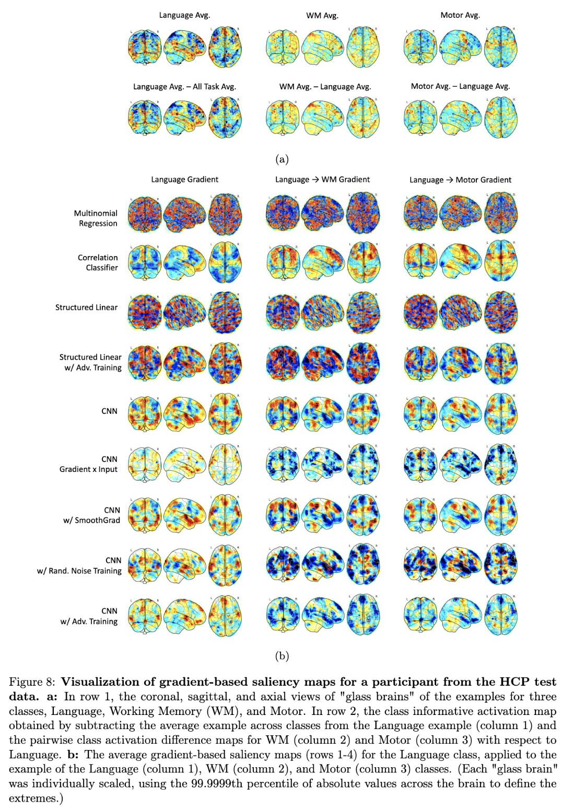

# Code for "Improving the Interpretability of fMRI Decoding using Deep Neural Networks and Adversarial Robustness"

This repository contains the code used for the experiments reported in "Improving the Interpretability of fMRI Decoding using Deep Neural Networks and Adversarial Robustness" (https://arxiv.org/abs/2004.11114).

The goal of this paper is to define measures of interpretability for fMRI decoding and use those to analyze different saliency-map methods for fMRI decoding. We test the proposed methods on sythetic and real-world fMRI data.

The synthetic data experiment code is in the "Synthetic" directory.

The fMRI data experiment code is in the "HCP" directory.

The results indicate that, for real-world fMRI data, using non-linear models, deep neural network in particular, and adversarial training can significantly improve the quality of gradient-based saliceny maps. Below are Figures 6a and 6b from the paper, which show this improvement for the proposed measures of interpretability -- i.e. class informative activation (CIA) and class activation difference (CAD) --. Visualizations of the resulting saliency maps for the different methods for fMRI decoding are shown also shown below in Figure 8.

